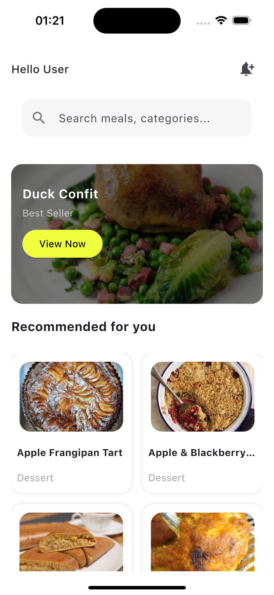
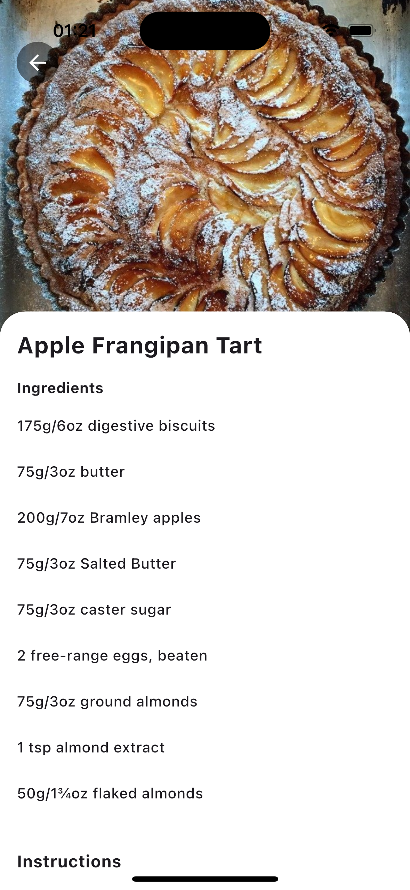

# 🍽️ Recipe Finder App

A simple and elegant Flutter application built for the Cybertechng task. It allows users to search and view recipes using [TheMealDB API](https://www.themealdb.com/api.php).

---

## 📸 Screenshots

### 🔍 Search Page


### 📋 Recipe Details


---

## 📦 Features

- 🔎 **Search Recipes**: Users can search recipes by keywords (e.g., "chicken").
- 🖼️ **Display Results**: View a list of recipes with thumbnails and names.
- 📖 **Detailed View**: View full ingredients, instructions, and images on tap.
- 🌀 **Loading/Error States**: Displays appropriate UI for loading, errors, and empty responses.

---

## 🔧 Tech Stack

- **State Management**: `flutter_riverpod`
- **Architecture**: Clean Architecture
- **API**: [TheMealDB](https://www.themealdb.com/api/json/v1/1/search.php?s=chicken)
- **Language**: Dart
- **Framework**: Flutter

---

## 🚀 How to Run the App

1. **Clone the repo**

```bash
git clone https://github.com/ayubasalami/cybertechng.git
cd cybertechng

2. Install dependencies

flutter pub get

3. flutter run


## App Project Structure 
lib/
├── core/
│   └── network/
│       └── dio_service.dart           # Handles API calls via Dio
│
├── features/
│   └── recipe_finder/
│       ├── data/
│       │   ├── models/                # API response models
│       │   └── repository/
│       │       └── recipe_repository.dart  # Handles API interactions
│       │
│       └── presentation/
│           ├── views/
│           │   ├── search_screen.dart
│           │   ├── recipe_details_screen.dart
│           │   └── recipe_details_page.dart
│           │
│           ├── view_models/
│           │   └── meal_search.view_model.dart  # Logic for searching recipes
│           │
│           └── widgets/
│               ├── app_search_bar.dart
│               ├── search_screen_header.dart
│               └── ... (reusable UI components)
│
├── providers/                         # Global providers
│   └── ...                           
│
└── main.dart                          # App entry point


🧠 Search Logic Overview
The app uses a MealSearchViewModel to handle user search interactions efficiently and responsively. When a user types into the search bar, the input is not immediately sent to the server. Instead, a short delay (called a debounce) is used to wait until the user stops typing before making the API call. This reduces unnecessary requests and improves performance.
The view model communicates with the repository to fetch meals from the API based on the user’s search keyword. It also manages different UI states such as loading, error, and displaying results. This ensures that the user sees appropriate feedback depending on whether the app is fetching data, has results to show, or encounters an error.

By centralizing this logic in the view model, the app remains modular, maintainable, and easy to test.


